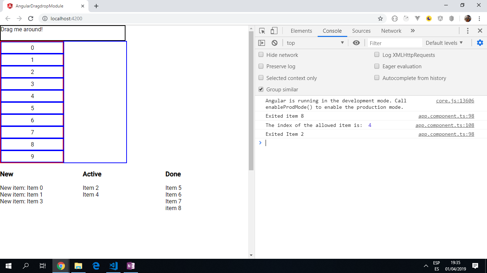

# :zap: Angular Material Table

* This project uses the [@angular/cdk/drag-drop module](https://material.angular.io/cdk/drag-drop/overview) to drag numbered boxes from a list on the left to a numbered list on the right and vice versa.
* Tutorial code from [Demos With Angular](https://www.youtube.com/channel/UCYFd7Qy93YP7gPERnxP545A) but with updates due to updated Angular/Material versions - see [:clap: Inspiration](#clap-inspiration) below

*** Note: to open web links in a new window use: _ctrl+click on link_**

## :page_facing_up: Table of contents

* [:zap: Angular Material Table](#zap-angular-material-table)
  * [:page_facing_up: Table of contents](#page_facing_up-table-of-contents)
  * [:books: General info](#books-general-info)
  * [:camera: Screenshots](#camera-screenshots)
  * [:signal_strength: Technologies](#signal_strength-technologies)
  * [:floppy_disk: Setup](#floppy_disk-setup)
  * [:computer: Code Examples](#computer-code-examples)
  * [:cool: Features](#cool-features)
  * [:clipboard: Status & To-Do List](#clipboard-status--to-do-list)
  * [:clap: Inspiration](#clap-inspiration)
  * [:envelope: Contact](#envelope-contact)

## :books: General info

* "The [@angular/cdk/drag-drop module](https://material.angular.io/cdk/drag-drop/overview) provides you with a way to easily and declaratively create drag-and-drop interfaces, with support for free dragging, sorting within a list, transferring items between lists, animations, touch devices, custom drag handles, previews, and placeholders, in addition to horizontal lists and locking along an axis."
* Important note: the version of Angular Material is important. Version 11 is used here which means cdkDrop**List** elements are used (i.e. 'cdkDrop' elements will not work).

## :camera: Screenshots



## :signal_strength: Technologies

* [Angular CLI v11](https://github.com/angular/angular-cli)
* [Angular Material v11](https://material.angular.io/)
* [Angular Material Drag and Drop Module](https://material.angular.io/cdk/drag-drop/overview)

## :floppy_disk: Setup

* Run `ng serve` for a dev server. Navigate to `http://localhost:4200/`. The app will automatically reload if you change any of the source files.
* Run `ng build` to build the project. The build artifacts will be stored in the `dist/` directory. Use the `--prod` flag for a production build.
* Run `ng lint` to check syntax using TSLint. Currently all files passing :-) Note [TSLint will be replaced with ESLint](https://github.com/palantir/tslint/issues/4534)

## :computer: Code Examples

* Function to move numbered blocks from 1 list to another.

```typescript
  drop(event: CdkDragDrop<number[]>) {
    console.log(event.previousContainer.data); // initially returns array (10) [0, 1, 2, 3, 4, 5, 6, 7, 8, 9]
    console.log(event.container.data); // initially returns []

      if (event.previousContainer !== event.container) { // check to see if moved across lists
      transferArrayItem(
        event.previousContainer.data,
        event.container.data,
        event.previousIndex,
        event.currentIndex
      );
    } else { // move within the same array and change index
      moveItemInArray(
        this.numbers,
        event.previousIndex,
        event.currentIndex
      );
    }
  }

```

## :cool: Features

* Drag and drop functionality - from one list to the other (with certain restrictions - e.g. you cannot move an active item back to the new items list).
* Items can be rearranged in their lists.
* Transitions used between lists
* Updated to latest Angular 11 and all dependencies up to date with no conflicts

## :clipboard: Status & To-Do List

* Status: Working app that shows off the [@angular/cdk/drag-drop](https://material.angular.io/cdk/drag-drop/overview) module.
* To-Do: nothing.

## :clap: Inspiration

* [Youtube tutorial: Drag and Drop with the Angular CDK - What's New in v7](https://www.youtube.com/watch?v=t1CrWLGxQPk).
* [Tim Deschryver's Exploring Drag and Drop with the new Angular Material CDK](https://blog.angularindepth.com/exploring-drag-and-drop-with-the-angular-material-cdk-2e0237857290)
* [Nwose Lotann´s Building Interactive Lists with the new Angular 7 Drag and Drop tool](https://blog.angularindepth.com/building-interactive-lists-with-the-new-angular-7-drag-and-drop-tool-5f2402f8cb27).
* [Sumit Vekariya's An Intro to Drag & Drop in Angular Using the CDK](https://alligator.io/angular/drag-drop/).

## :envelope: Contact

* Repo created by [ABateman](https://www.andrewbateman.org) - you are welcome to [send me a message](https://andrewbateman.org/contact)
